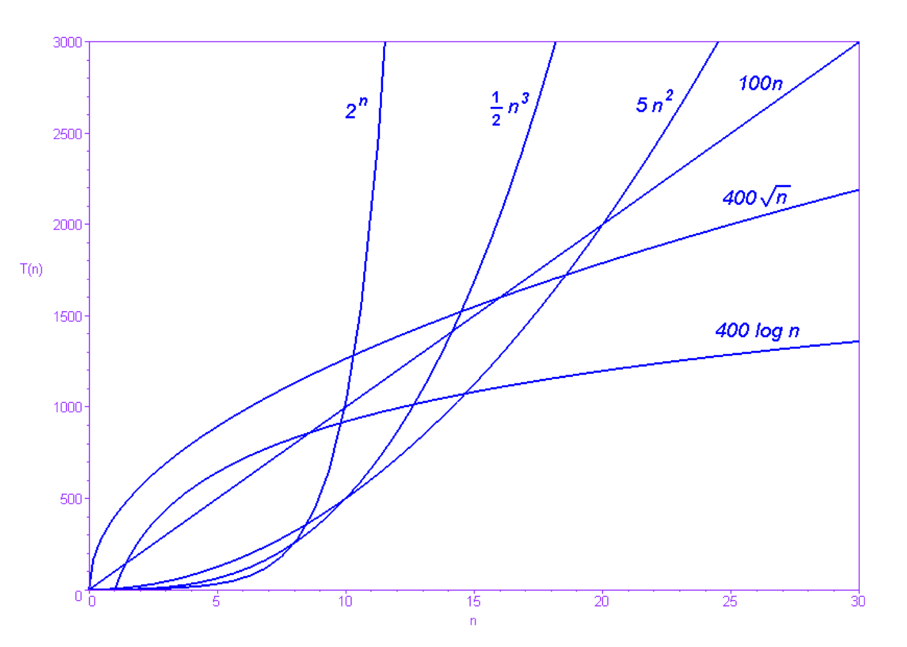

## Thế nào là độ hiệu quả của thuật toán?
Giả sử chúng ta được cho một mảng dữ liệu đầu vào (mảng A và số phần tử N), ta có thể tính chính xác số bước chạy của thuật toán trên đầu vào đã cho. Tuy nhiên, có rất nhiều giá trị mà bộ dữ liệu đầu vào có thể nhận nên việc tính toán số bước như trên với mọi khả năng đầu vào là không thể.

Thực tế trên dẫn ta tới câu hỏi quan trọng hơn: đánh giá quan trọng nhất về độ hiệu quả mà chúng ta cần tới là gì? Thông thường thì đó là tốc độ chạy thuật toán trong trường hợp xấu nhất. Tuy nhiên, thế nào là là trường hợp xấu nhất? Một cách đơn giản để làm cho thuật toán chạy chậm hơn là tăng kích cỡ đầu vào. Nhưng các câu hỏi quan trọng hơn là: tập đầu vào xấu nhất trong các tập có cùng số phần tử là tập nào? Khi tăng kích cỡ tập đầu vào thì độ phức tạp trong trường hợp xấu nhất tăng như thế nào?

## Tính toán độ hiệu quả của thuật toán như thế nào?
Nhắc lại rằng cho trước một bộ dữ liệu đầu vào, ta có thể đếm số bước thực hiện các phép toán của một thuật toán bằng cách mô phỏng các bước chạy thuật toán đó trên bộ dữ liệu được cho. Giả sử ta tiến hành đếm như vậy với tất cả các bộ dữ liệu có kích thước tối đa $N$. Ký hiệu $f(N)$ là số bước cần thực hiện nhiều nhất **(trường hợp xấu nhất)**. Hàm $f$ được gọi là **độ phức tạp thời gian**, hoặc dễ hiểu là **thời gian chạy của thuật toán**. Nói cách khác, nếu ta có dữ liệu vào với kích cỡ $N$, việc thực hiện thuật toán mất tối đa $f(N)$ bước.

Ví dụ 1: Giả sử bạn có đoạn mã sau (đây thực ra là một cách cài đặt của thuật toán **MinSort**):
```c
for (int i = 0; i < N; i++)
	for (int j = i + 1; j < N; j++)
		if (A[i] > A[j])
			swap(A[i], A[j]);
```

Tập đầu vào xấu nhất có $N$ phần tử là tập nào? Nói cách khác, trong số các mảng có $N$ phần tử, mảng nào khiến cho thuật toán phải thực hiện nhiều bước nhất? Từ đoạn mã của thuật toán ta thấy:

- Vòng **for** ngoài cùng được thực hiện đúng $N$ lần.
- Vòng **for** thứ hai và lệnh **if** được thực hiện đúng $\frac{N(N−1)}{2}$ lần.
- Hàm **swap** được thực hiện nhiều nhất $\frac{N(N−1)}{2}$ lần.

Dễ thấy nếu các phần tử trong mảng A được sắp xếp theo chiều giảm dần ngay từ đầu, bước thứ 4 sẽ luôn luôn được thực hiện. Vì vậy thuật toán sẽ chạy trong $\frac{3N(N−1)}{2}+N=1.5N^2−0.5N$ bước, cũng là số bước tối đa của thuật toán có thể chạy.

Có thể thấy rằng việc xác định chính xác hàm $f$ cho các chương trình phức tạp hơn là khá khó khăn. Thêm vào đó, trong nhiều trường hợp dạng chính xác của hàm $f$ là không cần thiết. Trong tính toán trên giá trị $−0.5N$ có thể bỏ qua, vì khi $N$ lớn thì $-0.5N$ nhỏ hơn rất nhiều so với $1.5N^2$ và không ảnh hưởng lớn tới thời gian chạy. Mệnh đề "$f(N)$ xấp xỉ bằng $1.5N^2$" cho ta tất cả thông tin mà ta cần. Tiếp theo chúng ta sẽ thấy rằng, khi so sánh thuật toán này với một thuật toán nào đó khác để giải cùng một bài toán, hằng số $1.5$ thật ra cũng không quan trọng.

Xét hai thuật toán, một có thời gian chạy $N^2$ và một có thời gian chạy $0.0001N^3$. Dễ nhận thấy rằng với $N>1000$ thì thuật toán đầu tiên chạy nhanh hơn - khi $N$ tăng, khoảng cách về độ hiệu quả giữa hai thuật toán càng trở nên rõ ràng. Trong khi thuật toán đầu tiên có thể giải quyết bài toán với $N=20000$ chỉ trong thời gian tính bằng giây, thuật toán thứ hai phải mất tới vài phút trên các máy tính hiện đại.

Sự khác biệt như trên sẽ xảy ra nếu một trong hai thuật toán có thời gian chạy **tăng lên đến tiệm cận** nhanh hơn so với thời gian chạy của thuật toán còn lại. Nói cách khác, khi N đủ lớn để kết quả phép tính giới hạn lim của tỷ lệ giữa hai đại lượng này bằng 0 hoặc $∞$. Bất kể các hằng số nhận giá trị nào, một thuật toán có thời gian chạy tỷ lệ (thuận) với $N^2$ sẽ luôn luôn hiệu quả hơn một thuật toán khác có thời gian chạy tỷ lệ với $N^3$ trong hầu hết các trường hợp của tập đầu vào. Nhận định này chính là ý tưởng chủ đạo để xây dựng định nghĩa chính thức của các khái niệm.


## Các khái niệm cơ bản
Gọi $f$,$g$ là các hàm số dương không giảm trên tập số nguyên dương (lưu ý rằng hàm thời gian chạy thỏa mãn điều kiện này). Ta nói rằng "$f(N)$ thuộc $O(g(N))$" (đường $f(N)$ nằm dưới đường $O(g(N))$) nếu tồn tại các giá trị $c$ và $N_0$ thỏa mãn điều kiện sau: $$\forall N > N0;f(N) \lt c.g(N)$$

Mệnh đề trên có thể diễn dịch như sau: $f(N)$ thuộc $O(g(N))$ nếu với $c$ nào đó toàn bộ đồ thị của hàm $f$ nằm dưới đồ thị của hàm $c.g$. Chú ý rằng điều này có nghĩa là tốc độ tăng của hàm $f$ không vượt quá độ tăng của hàm $g$. (ND: ký hiệu O-lớn là ký hiệu chỉ tập hợp của các hàm số, vì vậy ở đây quan hệ giữa $f$ và $O(g(N))$ là (phần tử) thuộc (tập hợp)).

Thay vì viết "$f(N)$ thuộc $O(g(N))$" ta thường viết là "$f(N) = O(g(N))$". Chú ý là dấu "=" không có tính đối xứng - viết "$O(g(N))=f(N)$" là sai và không có ý nghĩa gì. Đồng thời mệnh đề "$g(N)=O(f(N))$" cũng không phải luôn đúng. Từ định nghĩa đó ta thấy ký pháp O-lớn được sử dụng để chỉ ra cận trên của tốc độ tăng của một hàm số. (Me: mình không hiểu sao không phải là "$f(N) \in O(g(N))$" nhỉ?).

Xét hàm số $f(N)=1.5N^2–0.5N$ trong ví dụ 1. Ta có thể phát biểu rằng $f(N)=O(N^2)$ (với $c=2$ và $N_0=0$). Điều này có nghĩa là hàm $f$ không tăng (tiệm cận) nhanh hơn $N^2$.

Nhận định quan trọng rút ra từ ví dụ trên là thời gian chạy của hàm $f$ đó là hàm bậc hai. Nếu ta tăng gấp đôi kích cỡ đầu vào, thời gian chạy sẽ tăng xấp xỉ 4 lần thời gian chạy ban đầu, không quan trọng máy tính của ta nhanh như thế nào.

Vì vậy, chúng ta sẽ sử dụng ký pháp O-lớn để mô tả độ phức tạp thời gian (và đôi khi là cả bộ nhớ) của các thuật toán. Với thuật toán trong ví dụ 2 ta sẽ nói "Độ phức tạp thời gian của thuật toán này là $O(N^2)$" hoặc ngắn gọn hơn "Thuật toán này là $O(N^2)$".

Theo cách tương tự ta sẽ định nghĩa $\Omega$ (Omega-lớn) and $\Theta$ (Theta-lớn).

- Ta nói rằng $f(N)=\Omega (g(N))$ nếu $g(N)=O(f(N))$, nói cách khác nếu $f$ tăng nhanh hơn hoặc bằng $g$.
- Ta nói rằng $f(N)=\Theta (g(N))$ nếu $f(N)=O(g(N))$ và $g(N)=O(f(N))$, nói cách khác nếu cả hai hàm số có độ hiệu quả xấp xỉ bằng nhau.

Dễ dàng nhận thấy là hàm Omega-lớn dùng để chỉ cận dưới và hàm Theta-lớn dùng để chỉ đánh giá chặt (cả hai cận) của một hàm số. Có những đánh giá cận khác tương tự nhưng ít phổ biến hơn.

Một vài mệnh đề sử dụng các ký pháp trên (chú ý các ký hiệu $\Theta, O, \Omega$):
- $1.5N^2−0.5N=O(N^2)$.
- $47NlogN=O(N^2)$.
- $NlogN+1000047N=\Theta (NlogN)$.
- Tất cả các đa thức bậc $k$ là $O(N^k)$.
- Nếu một thuật toán thuộc $O(N^2)$, nó cũng thuộc $O(N^5)$ ($O(N^2)$ nằm phía dưới $O(N^5)$).
- Các thuật toán sắp xếp dựa trên phép so sánh đều là $\Omega (NlogN)$.
- Thuật toán sắp xếp trộn **MergeSort** chạy trên mảng gồm $N$ phần tử thực hiện xấp xỉ $NlogN$ phép so sánh. Vì vậy độ phức tạp thời gian của **MergeSort** là $\Theta (NlogN)$. Nếu mệnh đề trước đó là đúng thì **MergeSort** tiệm cận thuật toán tối ưu nhất trong các thuật toán sắp xếp dựa trên phép so sánh.
- Hàm số cho biết số răng của một người ở một thời điểm xác định là $O(1)$ (Số răng người không thể tăng đến dương vô cùng).
- Một thuật toán **quay lui** đơn giản giải các bài toán trên bàn cờ vua là $O(1)$ vì cây vị trí mà thuật toán duyệt qua có kích cỡ giới hạn. (Tuy nhiên giá trị hằng số trong $O(1)$ này lại rất lớn).

Khi nói về độ phức tạp thời gian/bộ nhớ của một thuật toán, thay vì sử dụng ký pháp Theta-lớn $\Theta (f(N))$ ta có thể đơn giản chỉ ra tên của lớp hàm chứa hàm $f$. Ví dụ với $f(N)=Θ(N)$, ta gọi thuật toán đó là tuyến tính. Một vài ví dụ khác:
- $f(N)=Θ(logN)$: hàm log
- $f(N)=Θ(N^2)$: hàm bậc 2
- $f(N)=Θ(N^3)$: hàm bậc 3
- $f(N)=O(N^k)$: hàm đa thức
- $f(N)=Ω(2^N)$: hàm mũ

Với các bài toán trên đồ thị, độ phức tạp $\Theta (N + M)$ được gọi là "tuyến tính theo độ lớn của đồ thị".

## Xác định thời gian chạy dựa vào đánh giá cận trên
Với hầu hết các thuật toán thường gặp trong thực tế, giá trị hằng số của $O$ (hoặc $Θ$) thường là khá nhỏ. Nếu một thuật toán là $Θ(N^2)$, độ phức tạp chính xác là vào khoảng $10N^2$ chứ không phải $10^7N^2$.

Nói cách khác: nếu hằng số là lớn thì thường là các hằng số đó có liên quan tới các đại lượng có sẵn trong đề bài. Trong trường hợp này cách làm thông thường là gán một tên gọi cho hằng số đó và thêm nó vào đánh giá độ phức tạp theo ký pháp, thay vì bỏ qua như ta đã làm với số "$1.5$" ở ví dụ 1.

Trong một kỳ thi trên TopCoder, một thuật toán thực thi 1 tỷ ($10^9$) phép nhân hiếm khi chạy trong giới hạn thời gian cho phép. Thực tế này cộng với quan sát ở trên và một vài kinh nghiệm với các bài toán trên **TopCoder** giúp ta tổng kết bảng sau:

| complexity | maximum N |
| -- | -- |
| $Θ(N)$ | 100 000 000 |
| $Θ(NlogN)$ | 40 000 000 |
| $Θ(N^2)$ | 10 000 |
| $Θ(N^3)$ | 500 |
| $Θ(N^4)$ | 90 |
| $Θ(2^N)$ | 20 |
| $Θ(N!)$ | 11 |

Bảng 3: Giá trị $N$ lớn nhất để các thuật toán có độ phức tạp khác nhau chạy trong tối đa 8 giây.

## Lưu ý khi phân tích độ phức tạp thuật toán
Thông thường khi trình bày một thuật toán, cách tốt nhất để đánh giá độ phức tạp của nó là ký pháp Theta-lớn $\Theta$. Tuy nhiên, trong thực tế thường ta chỉ trình bày cận O−lớn vì ký pháp này dễ viết hơn và phổ biến hơn. Nhắc lại rằng O−lớn chỉ mang ý nghĩa cận trên. Thông thường ta tìm cận trên O−lớn nhỏ nhất có thể.

Cho một mảng A đã được sắp xếp. Xác định xem liệu có tồn tại 2 phần tử trong mảng mà cách nhau D đơn vị hay không. Xét lời giải sau:

```c
int j = 0;
for(int i = 0; i < N; i++) {
	while ( (j < N-1) && (A[i] - A[j] > D) )
    	j++;
    if (A[i] - A[j] == D) return 1;
}
```

Thoạt nhìn ta có thể sẽ đánh giá thuật toán trên có cận $O(N^2)$ - vòng lặp trong cùng chạy $N$ lần, mỗi lần tăng biến $j$ tối đa $N$ lần. Phân tích kỹ hơn, ta thấy rằng cận trên có đánh giá tốt hơn là $O(N)$ - thật ra tổng thể số lần chạy câu lệnh `j++` trong toàn bộ thuật toán không vượt quá $N$ lần.

Mệnh đề "thuật toán trên là $O(N^2)$" vẫn là một mệnh đề đúng. Tuy nhiên bằng việc nói rằng "thuật toán trên là $O(N)$" ta cung cấp nhiều thông tin hơn về thuật toán đó.

## Kết luận
Chúng ta đã chỉ ra cách viết các cận (trên, dưới) theo độ phức tạp tính toán của thuật toán. Ta cũng đã chứng minh rằng các cận đó là các thuộc tính cơ bản và thường là hiệu quả để đánh giá các thuật toán. Trong phần sau chúng ta sẽ phân tích làm thế nào để ước lượng độ phức tạp tính toán của các thuật toán. Như ta đã thấy trong ví dụ 2 việc phân tích này có thể trở nên khá khó khăn. Một nguyên nhân khác làm cho việc phân tích khó khăn là các thuật toán đệ quy. Các vấn đề này sẽ được xử lý trong phần 2 của bài viết.

<script src="https://polyfill.io/v3/polyfill.min.js?features=es6"></script>